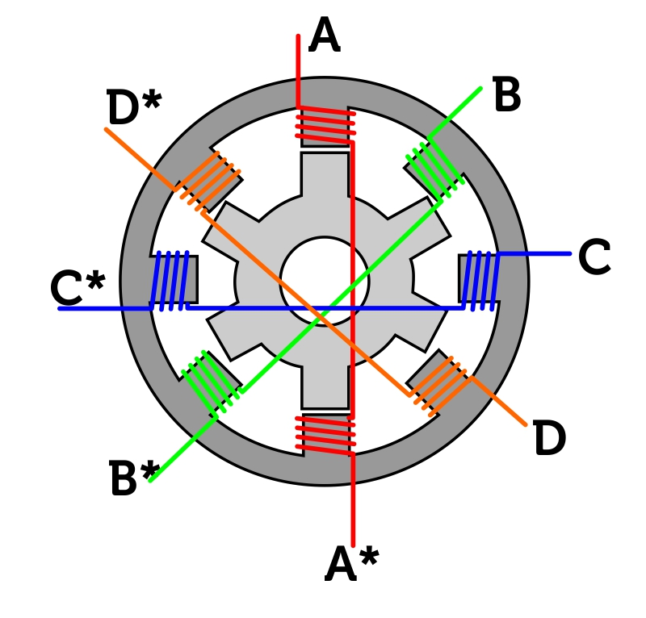
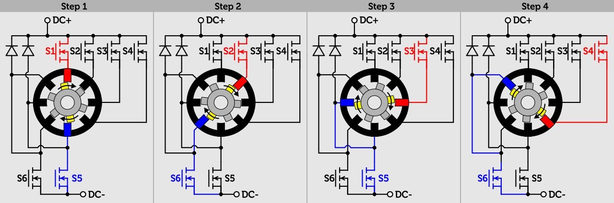
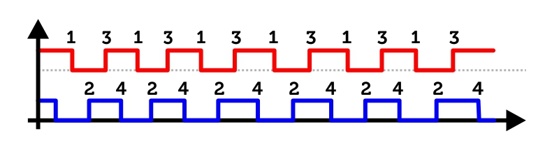

# ArduinoSRDrive

This repository contains code for the Arduino Leonardo to control a 4-phase 8/6-pole Switched Reluctance Motor as it can be found in the Vorwerk Thermomix TM31 and other devices.

## Switched Reluctance Motordrive
This type of motor does not use any rare earths or rotors-windings but only sheets of electric metal. Another benefit of this type of motor: it does neither need a high-performance sine-wave-current nor a field-oriented control, but can be controlled only using cheap digital logic. Within the so called switched reluctance motor (SR-drive) the phase next to the rotor will be switched to the DC-supply to pull the rotor in the desired direction.

There are several possible options to control the SR-drive. A very semiconductor-saving variant is shown below. Only one MOSFET is used per phase and additional two MOSFETs for a connection to the DC minus. So the connection of the power-electronics and the pulse-pattern looks like this:

The individual switching-patterns can be read from the following table:

|State|S1|S2|S3|S4|S5|S6|
|---|---|---|---|---|---|---|---|---|
|1|1|0|0|0|1|0|
|2|0|1|0|0|0|1|
|3|0|0|1|0|1|0|
|4|0|0|0|1|0|1|

## Reading the hall-sensors
To detect the position of the rotor, hall-sensors are applied on the stator, connected to a small decoder-IC. Two signals can be measured on the outputs of this Hall-signal IC: on each rising edge of signal one, the rotor is at position 1, on rising edge of signal 2 the rotor reaches position 2. Position 3 is on the falling edge of signal 1 and falling edge of signal 2 marks the position 4:

## Hardware-connections
You need nine connections between the Arduino Leonardo and the Thermomix TM31 PCB:

|Arduino Pin|Description|Thermomix PCB|
|---|---|---|
|2|Interrupt-Input for Hall-Signal 1|CN300.5|
|3|Interrupt-Input for Hall-Signal 2|CN300.4|
|8|Gate-Output to MOSFET S1|JB11|
|9|Gate-Output to MOSFET S2|JB10|
|10|Gate-Output to MOSFET S3|JA10|
|11|Gate-Output to MOSFET S4|JA8|
|12|Gate-Output to MOSFET S5|JB12|
|13|Gate-Output to MOSFET S6|JB13|
|GND|Ground|TB3|

## Tests
With this small piece of code it is possible to control a full-featured motor with control over speed and left/right-rotation. Have a look on the results by your own on the following video:

<video width="800" height="450" controls>
  <source src="https://chrisdevblog.com/content/videos/20210629_174150.mp4" type="video/mp4">
Your browser does not support the video tag.
</video>

